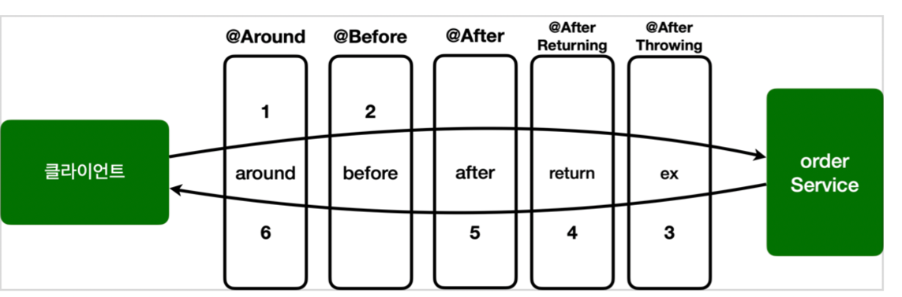

# SpringAopEx

# 어드바이스 종류

- @Around : 메서드 호출 전후에 수행, 가장 강력한 어드바이스, 조인 포인트 실행 여부 선택, 반환 값 변환, 예외 변환 등이 가능
- @Before : 조인 포인트 실행 이전에 실행
- @AfterReturning : 조인 포인트가 정상 완료후 실행 
- @AfterThrowing : 메서드가 예외를 던지는 경우 실행 
- @After : 조인 포인트가 정상 또는 예외에 관계없이 실행(finally)

## JoinPoint 인터페이스의 주요 기능
- getArgs() : 메서드 인수를 반환
- getThis() : 프록시 객체를 반환
- getTarget() : 대상 객체를 반환
- getSignature() : 조언되는 메서드에 대한 설명을 반환합니다. toString() : 조언되는 방법에 대한 유용한 설명을 인쇄

## ProceedingJoinPoint 인터페이스의 주요 기능
- proceed() : 다음 어드바이스나 타켓을 호출

## @Before
조인 포인트 실행 전

```java
  @Before("hello.aop.order.aop.Pointcuts.orderAndService()")
  public void doBefore(JoinPoint joinPoint) {
      log.info("[before] {}", joinPoint.getSignature());
  }
```

@Around 와 다르게 작업 흐름을 변경할 수는 없다.
@Around 는 ProceedingJoinPoint.proceed() 를 호출해야 다음 대상이 호출된다. 
만약 호출하지 않으면 다음 대상이 호출되지 않는다. 반면에 @Before 는 ProceedingJoinPoint.proceed() 자체를 사용하지 않는다. 
메서드 종료시 자동으로 다음 타켓이 호출된다. 물론 예외가 발생하면 다음 코드가 호출되지는 않는다.

## @AfterReturning
메서드 실행이 정상적으로 반환될 때 실행
```java
   @AfterReturning(value = "hello.aop.order.aop.Pointcuts.orderAndService()", returning = "result")
  public void doReturn(JoinPoint joinPoint, Object result) {
      log.info("[return] {} return={}", joinPoint.getSignature(), result);
  }
```
- returning 속성에 사용된 이름은 어드바이스 메서드의 매개변수 이름과 일치해야 한다.
- returning 절에 지정된 타입의 값을 반환하는 메서드만 대상으로 실행한다. (부모 타입을 지정하면 모든 자식 타입은 인정된다.)
- @Around 와 다르게 반환되는 객체를 변경할 수는 없다. 반환 객체를 변경하려면 @Around 를 사용해야
  한다. 참고로 반환 객체를 조작할 수 는 있다.

## @AfterThrowing
메서드 실행이 예외를 던져서 종료될 때 실행
```java
  @AfterThrowing(value = "hello.aop.order.aop.Pointcuts.orderAndService()", throwing = "ex")
  public void doThrowing(JoinPoint joinPoint, Exception ex) {
      log.info("[ex] {} message={}", joinPoint.getSignature(), ex.getMessage());
  }
```
- throwing 속성에 사용된 이름은 어드바이스 메서드의 매개변수 이름과 일치해야 한다.
- throwing 절에 지정된 타입과 맞은 예외를 대상으로 실행한다. (부모 타입을 지정하면 모든 자식 타입은 인정된다.)

## @After
- 메서드 실행이 종료되면 실행된다. (finally를 생각하면 된다.) 
- 정상 및 예외 반환 조건을 모두 처리한다. 
- 일반적으로 리소스를 해제하는 데 사용한다.

## @Around
- 메서드의 실행의 주변에서 실행된다. 메서드 실행 전후에 작업을 수행한다. 
  - 가장 강력한 어드바이스 
  - 조인 포인트 실행 여부 선택 joinPoint.proceed() 호출 여부 선택 
  - 전달 값 변환: joinPoint.proceed(args[])
  - 반환 값 변환
  - 예외 변환
  - 트랜잭션 처럼 try ~ catch~ finally 모두 들어가는 구문 처리 가능 
- 어드바이스의 첫 번째 파라미터는 ProceedingJoinPoint 를 사용해야 한다.
- proceed() 를 통해 대상을 실행한다. 
- proceed() 를 여러번 실행할 수도 있음(재시도)


## 순서
- 스프링은 5.2.7 버전부터 동일한 @Aspect 안에서 동일한 조인포인트의 우선순위를 정했다.
- 실행 순서: @Around , @Before , @After , @AfterReturning , @AfterThrowing
- 어드바이스가 적용되는 순서는 이렇게 적용되지만, 호출 순서와 리턴 순서는 반대
- 물론 @Aspect 안에 동일한 종류의 어드바이스가 2개 있으면 순서가 보장되지 않는다. 이 경우 앞서 배운 것 처럼 @Aspect 를 분리하고 @Order 를 적용한다.

# 포인트컷 지시자
포인트컷 표현식은 execution 같은 포인트컷 지시자(Pointcut Designator)로 시작한다. 줄여서 PCD라 한다.

## 포인트컷 지시자의 종류
- execution : 메소드 실행 조인 포인트를 매칭한다. 스프링 AOP에서 가장 많이 사용하고, 기능도 복잡하다.
- within : 특정 타입 내의 조인 포인트를 매칭한다.
- args : 인자가 주어진 타입의 인스턴스인 조인 포인트 
- this : 스프링 빈 객체(스프링 AOP 프록시)를 대상으로 하는 조인 포인트 
- target : Target 객체(스프링 AOP 프록시가 가르키는 실제 대상)를 대상으로 하는 조인 포인트 
- @target : 실행 객체의 클래스에 주어진 타입의 애노테이션이 있는 조인 포인트
- @within : 주어진 애노테이션이 있는 타입 내 조인 포인트 
- @annotation : 메서드가 주어진 애노테이션을 가지고 있는 조인 포인트를 매칭 
- @args : 전달된 실제 인수의 런타임 타입이 주어진 타입의 애노테이션을 갖는 조인 포인트 
- bean : 스프링 전용 포인트컷 지시자, 빈의 이름으로 포인트컷을 지정한다.